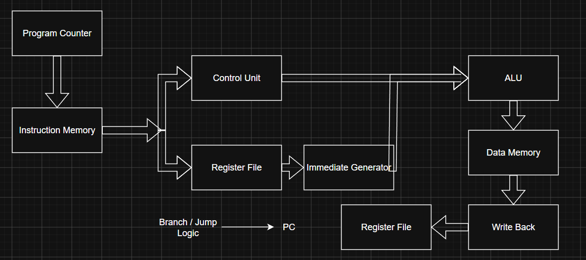
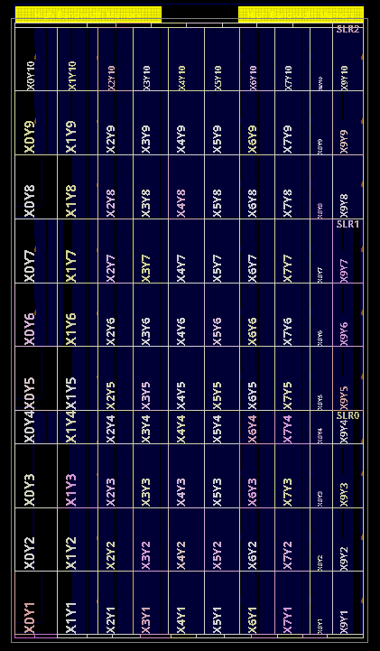

# 32-bit Single-Cycle RISC-V (RV32I) CPU

A 32-bit **single-cycle RISC-V processor** designed from scratch in **Verilog HDL**. The CPU implements 17 RV32I instructions spanning arithmetic, logical, memory, branch, and jump operations.

The processor was developed as a complete RTL design project: individual hardware modules were implemented and integrated into a single-cycle datapath, verified through automated randomized regression testing and GTKWave waveform analysis, and synthesized using Yosys to inspect the resulting hardware structures.

---

## Overview

The processor executes each instruction in a single clock cycle through the complete:

**Fetch → Decode → Execute → Memory → Write-Back**

datapath.

The design integrates a **32-bit Program Counter, Instruction Memory, 32 × 32-bit Register File, Immediate Generator, Control Unit, ALU, Data Memory, and control-flow logic** into a complete processor.

It supports register and immediate ALU operations, memory access, conditional branches, and jump instructions.

---

## Processor Architecture



---

## Supported RV32I Instructions

The current processor implements **17 instructions**.

| Type | Instructions | Function |
|---|---|---|
| R-Type | `ADD` | Register addition |
| | `SUB` | Register subtraction |
| | `AND` | Bitwise AND |
| | `OR` | Bitwise OR |
| | `XOR` | Bitwise XOR |
| | `SLT` | Signed set-less-than |
| I-Type | `ADDI` | Immediate addition |
| | `ANDI` | Immediate bitwise AND |
| | `ORI` | Immediate bitwise OR |
| | `XORI` | Immediate bitwise XOR |
| | `SLTI` | Signed immediate set-less-than |
| Memory | `LW` | Load 32-bit word |
| | `SW` | Store 32-bit word |
| Branch | `BEQ` | Branch if equal |
| | `BNE` | Branch if not equal |
| Jump | `JAL` | Jump and link |
| | `JALR` | Jump and link register |

---
# How the CPU Works

The processor uses a **single-cycle architecture**, meaning each instruction completes the full fetch, decode, execute, memory, and write-back process within one clock cycle.

### 1. Instruction Fetch

The **Program Counter (PC)** holds the address of the current instruction. Instruction memory uses this address to fetch the corresponding 32-bit RISC-V instruction.

### 2. Instruction Decode

The instruction is decoded by the **Control Unit**, which generates the control signals required for execution. The **Register File** simultaneously reads the source registers specified by the instruction.

### 3. Immediate Generation

For instructions containing an immediate value, the **Immediate Generator** extracts and sign-extends the immediate according to the RISC-V instruction format.

### 4. Execute

The **ALU** performs the required arithmetic, logical, or comparison operation. A multiplexer selects either register data or the immediate value as the second ALU operand.

Supported ALU operations include:

`ADD` `SUB` `AND` `OR` `XOR` `SLT`

### 5. Memory Access

Load and store instructions use the ALU result as the data-memory address.

- `LW` reads a 32-bit word from memory.
- `SW` writes a 32-bit word to memory.

### 6. Write-Back

The write-back logic selects the value returned to the Register File. Depending on the instruction, this can be the **ALU result, memory data, or PC + 4**.

### 7. Branches and Jumps

Branch instructions compare register values and redirect the PC when the branch condition is satisfied.

`BEQ` and `BNE` use conditional branch targets, while `JAL` and `JALR` implement unconditional jumps. Jump instructions also write **PC + 4** to the destination register.

### Single-Cycle Execution

Because the processor is single-cycle, all of these operations occur during one clock period:

```text
Fetch → Decode → Execute → Memory → Write-Back
```

At the next clock edge, the PC is updated and execution begins for the next instruction.

---

# Verification

The CPU was verified at both the **module level** and **processor level**.

### Module-Level Verification

Each major hardware block was first tested independently using custom Verilog testbenches, including the Program Counter, Instruction Memory, Register File, Immediate Generator, Control Unit, ALU, and Data Memory.

GTKWave was used throughout development to inspect the behavior of each module and verify signals, timing, control logic, and data flow before integrating the complete CPU.

Waveforms from these tests can be found in the [`GTKWaves/`](GTKWaves/) directory.

### Automated CPU Regression Testing

After integration, the complete CPU was verified using a **Python-driven randomized regression framework**.

For each supported instruction, the framework:

1. Generates randomized input values.
2. Encodes them into RV32I machine instructions.
3. Loads the generated program into instruction memory.
4. Runs the CPU using Icarus Verilog.
5. Reads the resulting register and memory state.
6. Compares the hardware result against the expected result.

This provides repeatable processor-level verification across many different operand combinations rather than relying only on hand-written test programs.

The regression suite covers all **17 implemented instructions**:

`ADD` `SUB` `AND` `OR` `XOR` `SLT`  
`ADDI` `ANDI` `ORI` `XORI` `SLTI`  
`LW` `SW` `BEQ` `BNE` `JAL` `JALR`


---

### Full CPU Waveform Verification

In addition to automated testing, the complete processor was inspected in GTKWave using a demonstration program that exercises the datapath.

Signals such as the **PC, instruction, register operands, immediate, ALU result, memory controls, write-back data, branch decisions, and jump targets** were monitored to verify instruction execution through the single-cycle datapath.

This makes it possible to visually follow instructions through the complete single-cycle datapath.


A more detailed example of CPU execution and the corresponding waveform is shown below.

## RTL Synthesis

The complete processor was synthesized using both **Yosys** and **AMD Vivado** to verify that the Verilog RTL could be successfully translated into digital hardware structures using two different synthesis flows.

While RTL simulation and regression testing verify the **functional behavior** of the processor, synthesis verifies that the design can be elaborated and converted into a hardware netlist.

---

## Yosys Synthesis

The processor was first synthesized using **Yosys**, an open-source RTL synthesis framework.

Yosys reads the Verilog hierarchy, elaborates the processor modules, converts behavioral RTL into hardware cells, and performs logic optimization.

During synthesis, RTL operations are translated into hardware structures including:

- Adders and subtractors
- Comparators
- Multiplexers
- Flip-flops
- Boolean logic
- Register control logic
- Branch and jump selection logic

### Synthesized ALU

The ALU was synthesized independently to inspect how arithmetic and logical Verilog operations are translated into hardware.

```verilog
result = a + b;
result = a - b;
result = a & b;
result = a | b;
result = a ^ b;
```

Yosys translates these RTL operations into corresponding arithmetic and logical hardware cells, with multiplexing logic selecting the correct result based on the ALU control signal.
<p align="center">
  
</p>

### Full CPU Yosys Synthesis

The complete processor was then synthesized as a single integrated design.

<p align="center">
  
</p>

The synthesized design contains the combined datapath and control logic required by the processor, including:

- Program Counter and next-PC logic
- Register File
- Immediate generation
- Arithmetic and logical operations
- Branch comparison logic
- JAL and JALR target logic
- Memory control logic
- Write-back selection
- Control decoding
- Datapath multiplexers

The full CPU schematic is significantly larger than the individual ALU because it represents the interconnected logic required to execute all **17 supported RV32I instructions**.

Successful Yosys synthesis demonstrates that the complete processor RTL can be elaborated and translated into a digital logic netlist rather than functioning only as behavioral simulation code.

For a higher-resolution view:

[View Full CPU Yosys Schematic](rtl/cpu_synth.svg)

---

## Vivado Synthesis

The complete CPU was also synthesized using **AMD Vivado** to verify the design using a commercial FPGA development toolchain.

Vivado elaborates the Verilog RTL, checks the design hierarchy, performs logic optimization, and synthesizes the processor toward the selected AMD/Xilinx FPGA architecture.

### Vivado Synthesized Design

After RTL elaboration, the processor was synthesized using Vivado.



The synthesized schematic shows the processor after Vivado has optimized and mapped the RTL toward FPGA hardware resources.

High-level Verilog operations are transformed into lower-level hardware structures implementing the processor's arithmetic, control, storage, and datapath logic.

---
## Example CPU Execution

The waveform below shows the processor executing a short sequence of RV32I instructions through the single-cycle datapath.

### Example Program

```assembly
addi x1, x0, 5       # x1 = 5
addi x2, x0, 7       # x2 = 7
add  x3, x1, x2      # x3 = 12
sw   x3, 0(x4)       # Store x3 to memory
lw   x5, 0(x4)       # Load value back into x5
```

### Execution

| PC | Instruction | Result |
|---|---|---|
| `0x00` | `addi x1, x0, 5` | `x1 = 5` |
| `0x04` | `addi x2, x0, 7` | `x2 = 7` |
| `0x08` | `add x3, x1, x2` | `x3 = 12` |
| `0x0C` | `sw x3, 0(x4)` | Stores `12` to data memory |
| `0x10` | `lw x5, 0(x4)` | Loads `12` from data memory |

### GTKWave Verification


The waveform shows the **PC advancing by 4 bytes each cycle** as instructions move through the processor.

At `PC = 0x08`, the `ADD` instruction reads `5` and `7` from the register file and the ALU produces `0x0000000C` (12). The following `SW` instruction asserts the memory write control to store the result, and `LW` reads the value back from data memory.

The waveform also exposes the internal datapath signals—including the instruction, ALU inputs/result, register data, immediate value, memory controls, next PC, and write-back data—allowing instruction execution to be followed through the complete CPU.

---

## Compile the CPU

```bash
make
```

## Run the Simulation

```bash
vvp sim.out
```

## Run Automated Regression

```bash
python verify/regression.py
```

## Generate the Waveform Demo

```bash
make wave
```

Then open the generated VCD in GTKWave if it is not opened automatically.

---

# Tools

| Tool | Purpose |
|---|---|
| Verilog HDL | RTL processor implementation |
| Icarus Verilog | RTL simulation |
| GTKWave | Waveform analysis |
| Python | Automated verification framework |
| Yosys | RTL synthesis |
| Graphviz | Synthesized schematic visualization |
| Git | Version control |

---

# Skills Demonstrated

- RTL Design
- RISC-V ISA
- Computer Architecture
- Processor Datapath Design
- Control Logic Design
- Verilog HDL
- Instruction Encoding
- Register File Design
- ALU Design
- Memory Interfaces
- Branch and Jump Logic
- Hardware Verification
- Randomized Regression Testing
- Waveform Analysis
- RTL Synthesis
- Debugging

---

# Author

## Tanay Ubale

Electrical and Computer Engineering  
Purdue University

**GitHub:** [https://github.com/tubale](https://github.com/tubale) 

**LinkedIn:** https://www.linkedin.com/in/tanayubale/
