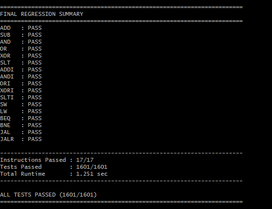
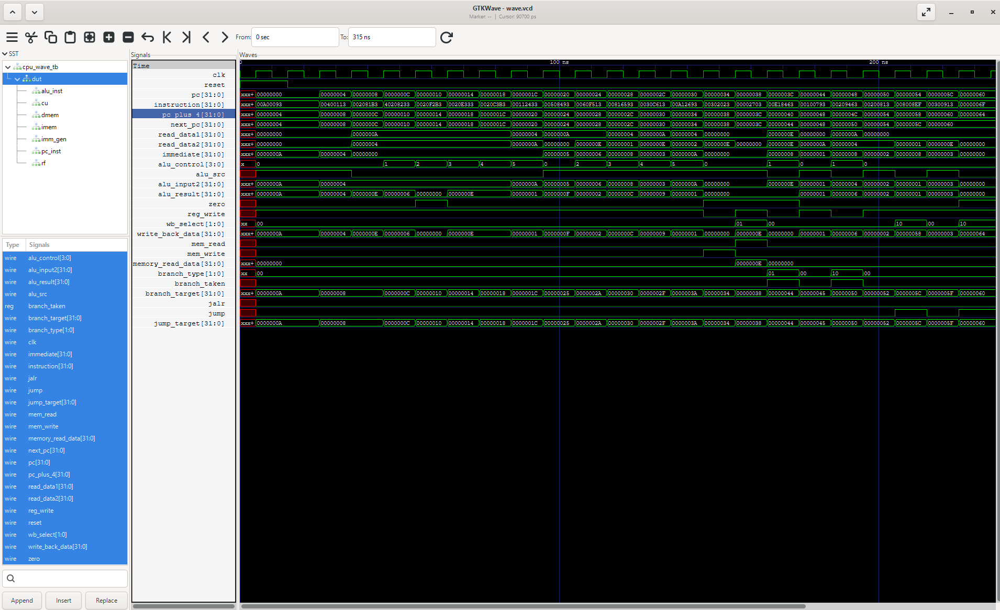
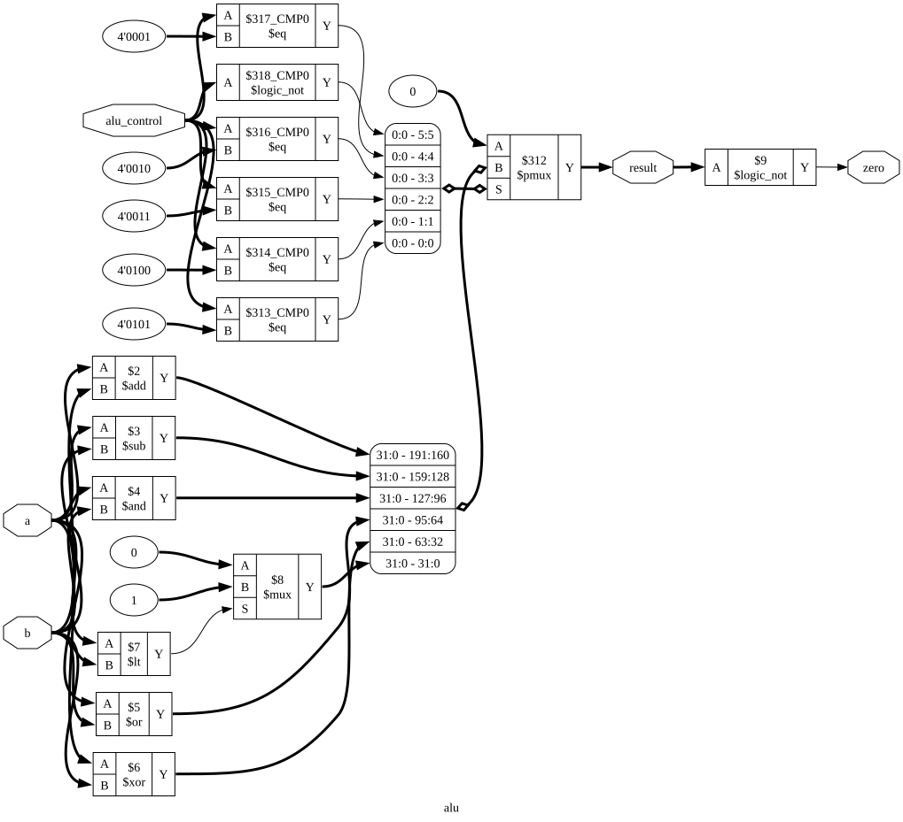
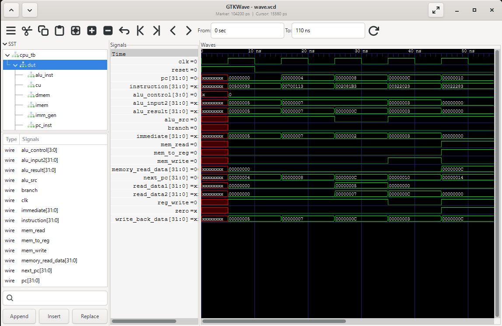

# 32-bit Single-Cycle RISC-V (RV32I) CPU

A 32-bit **single-cycle RISC-V processor** designed from scratch in **Verilog HDL**. The CPU implements 17 RV32I instructions spanning arithmetic, logical, memory, branch, and jump operations.

The processor was developed as a complete RTL design project: individual hardware modules were implemented and integrated into a single-cycle datapath, verified through automated randomized regression testing and GTKWave waveform analysis, and synthesized using Yosys to inspect the resulting hardware structures.

---

## Overview

The processor executes each instruction in a single clock cycle through the complete:

**Fetch → Decode → Execute → Memory → Write-Back**

datapath.

The design integrates a **32-bit Program Counter, Instruction Memory, 32 × 32-bit Register File, Immediate Generator, Control Unit, ALU, Data Memory, and control-flow logic** into a complete processor.

It supports register and immediate ALU operations, memory access, conditional branches, and jump instructions.
---

## Processor Architecture

```text
                         ┌──────────────────┐
                         │ Program Counter  │
                         └────────┬─────────┘
                                  │
                                  ▼
                         ┌──────────────────┐
                         │Instruction Memory│
                         └────────┬─────────┘
                                  │
                             Instruction
                                  │
                  ┌───────────────┴───────────────┐
                  │                               │
                  ▼                               ▼
          ┌──────────────┐                ┌───────────────┐
          │ Control Unit │                │ Register File │
          └──────┬───────┘                └───────┬───────┘
                 │                                │
                 │                       ┌────────┴────────┐
                 │                       │ Immediate Gen. │
                 │                       └────────┬────────┘
                 │                                │
                 └────────────────┬───────────────┘
                                  │
                                  ▼
                          ┌───────────────┐
                          │ ALU Input MUX │
                          └───────┬───────┘
                                  │
                                  ▼
                             ┌─────────┐
                             │   ALU   │
                             └────┬────┘
                                  │
                 ┌────────────────┼────────────────┐
                 │                │                │
                 ▼                ▼                ▼
          Branch Logic      Data Memory       ALU Result
                 │                │                │
                 └────────┐       │       ┌────────┘
                          │       ▼       │
                          │  ┌──────────┐ │
                          │  │Write-Back│ │
                          │  │   MUX    │ │
                          │  └────┬─────┘ │
                          │       │       │
                          │       ▼       │
                          │ Register File │
                          │               │
                          ▼               │
                     Next-PC Logic ◄──────┘
                          │
                          └──────► PC
```

---

## Supported RV32I Instructions

The current processor implements **17 instructions**.

| Type | Instructions | Function |
|---|---|---|
| R-Type | `ADD` | Register addition |
| | `SUB` | Register subtraction |
| | `AND` | Bitwise AND |
| | `OR` | Bitwise OR |
| | `XOR` | Bitwise XOR |
| | `SLT` | Signed set-less-than |
| I-Type | `ADDI` | Immediate addition |
| | `ANDI` | Immediate bitwise AND |
| | `ORI` | Immediate bitwise OR |
| | `XORI` | Immediate bitwise XOR |
| | `SLTI` | Signed immediate set-less-than |
| Memory | `LW` | Load 32-bit word |
| | `SW` | Store 32-bit word |
| Branch | `BEQ` | Branch if equal |
| | `BNE` | Branch if not equal |
| Jump | `JAL` | Jump and link |
| | `JALR` | Jump and link register |

---
# How the CPU Works

The processor uses a **single-cycle architecture**, meaning each instruction completes the full fetch, decode, execute, memory, and write-back process within one clock cycle.

### 1. Instruction Fetch

The **Program Counter (PC)** holds the address of the current instruction. Instruction memory uses this address to fetch the corresponding 32-bit RISC-V instruction.

### 2. Instruction Decode

The instruction is decoded by the **Control Unit**, which generates the control signals required for execution. The **Register File** simultaneously reads the source registers specified by the instruction.

### 3. Immediate Generation

For instructions containing an immediate value, the **Immediate Generator** extracts and sign-extends the immediate according to the RISC-V instruction format.

### 4. Execute

The **ALU** performs the required arithmetic, logical, or comparison operation. A multiplexer selects either register data or the immediate value as the second ALU operand.

Supported ALU operations include:

`ADD` `SUB` `AND` `OR` `XOR` `SLT`

### 5. Memory Access

Load and store instructions use the ALU result as the data-memory address.

- `LW` reads a 32-bit word from memory.
- `SW` writes a 32-bit word to memory.

### 6. Write-Back

The write-back logic selects the value returned to the Register File. Depending on the instruction, this can be the **ALU result, memory data, or PC + 4**.

### 7. Branches and Jumps

Branch instructions compare register values and redirect the PC when the branch condition is satisfied.

`BEQ` and `BNE` use conditional branch targets, while `JAL` and `JALR` implement unconditional jumps. Jump instructions also write **PC + 4** to the destination register.

### Single-Cycle Execution

Because the processor is single-cycle, all of these operations occur during one clock period:

```text
Fetch → Decode → Execute → Memory → Write-Back
```

At the next clock edge, the PC is updated and execution begins for the next instruction.

---

# Verification

The CPU was verified at both the **module level** and **processor level**.

### Module-Level Verification

Each major hardware block was first tested independently using custom Verilog testbenches, including the Program Counter, Instruction Memory, Register File, Immediate Generator, Control Unit, ALU, and Data Memory.

GTKWave was used throughout development to inspect the behavior of each module and verify signals, timing, control logic, and data flow before integrating the complete CPU.

Waveforms from these tests can be found in the [`GTKWaves/`](GTKWaves/) directory.

### Automated CPU Regression Testing

After integration, the complete CPU was verified using a **Python-driven randomized regression framework**.

For each supported instruction, the framework:

1. Generates randomized input values.
2. Encodes them into RV32I machine instructions.
3. Loads the generated program into instruction memory.
4. Runs the CPU using Icarus Verilog.
5. Reads the resulting register and memory state.
6. Compares the hardware result against the expected result.

This provides repeatable processor-level verification across many different operand combinations rather than relying only on hand-written test programs.

The regression suite covers all **17 implemented instructions**:

`ADD` `SUB` `AND` `OR` `XOR` `SLT`  
`ADDI` `ANDI` `ORI` `XORI` `SLTI`  
`LW` `SW` `BEQ` `BNE` `JAL` `JALR`




---

### Full CPU Waveform Verification

In addition to automated testing, the complete processor was inspected in GTKWave using a demonstration program that exercises the datapath.

Signals such as the **PC, instruction, register operands, immediate, ALU result, memory controls, write-back data, branch decisions, and jump targets** were monitored to verify instruction execution through the single-cycle datapath.

This makes it possible to visually follow instructions through the complete single-cycle datapath.



A more detailed example of CPU execution and the corresponding waveform is shown below.

# RTL Synthesis

The processor RTL was synthesized using **Yosys** to verify that the behavioral Verilog could be translated into hardware structures.

During synthesis, RTL operations were converted into hardware elements including:

- Adders
- Subtractors
- Comparators
- Multiplexers
- Flip-flops
- Boolean logic
- Register and memory control logic

For example, the ALU RTL:

```verilog
result = a + b;
result = a - b;
result = a & b;
result = a | b;
result = a ^ b;
```

was synthesized into corresponding `$add`, `$sub`, `$and`, `$or`, and `$xor` hardware cells.

## Synthesized ALU

The following schematic was generated directly from the Verilog RTL using Yosys and Graphviz:



The schematic shows the arithmetic/logic hardware and control-selection network inferred from the ALU RTL.

## Full CPU Synthesis

The complete processor was also passed through the Yosys synthesis flow to inspect the combined datapath and control implementation.

[View Full CPU Synthesis Schematic](rtl/cpu_synth.svg)

The full schematic is linked rather than embedded because the processor contains significantly more logic than the individual ALU.

---

## Example CPU Execution
### Program

```assembly
addi x1, x0, 10       # x1 = 10
addi x2, x0, 4        # x2 = 4

add  x3, x1, x2       # x3 = 14
sub  x4, x1, x2       # x4 = 6

sw   x3, 0(x0)        # memory[0] = 14
lw   x14, 0(x0)       # x14 = 14

beq  x3, x14, equal   # Branch taken because 14 == 14

addi x15, x0, 99      # Skipped

equal:
addi x15, x0, 1       # x15 = 1
```

### Expected Execution

| PC | Instruction | Result |
|---:|---|---|
| `0x00` | `addi x1, x0, 10` | `x1 = 10` |
| `0x04` | `addi x2, x0, 4` | `x2 = 4` |
| `0x08` | `add x3, x1, x2` | `x3 = 14` |
| `0x0C` | `sub x4, x1, x2` | `x4 = 6` |
| `0x10` | `sw x3, 0(x0)` | `memory[0] = 14` |
| `0x14` | `lw x14, 0(x0)` | `x14 = 14` |
| `0x18` | `beq x3, x14, +8` | Branch taken |
| `0x1C` | `addi x15, x0, 99` | **Skipped** |
| `0x20` | `addi x15, x0, 1` | `x15 = 1` |

### Waveform



## Compile the CPU

```bash
make
```

## Run the Simulation

```bash
vvp sim.out
```

## Run Automated Regression

```bash
python verify/regression.py
```

## Generate the Waveform Demo

```bash
make wave
```

Then open the generated VCD in GTKWave if it is not opened automatically.

---

# Tools

| Tool | Purpose |
|---|---|
| Verilog HDL | RTL processor implementation |
| Icarus Verilog | RTL simulation |
| GTKWave | Waveform analysis |
| Python | Automated verification framework |
| Yosys | RTL synthesis |
| Graphviz | Synthesized schematic visualization |
| Git | Version control |

---

# Skills Demonstrated

- RTL Design
- RISC-V ISA
- Computer Architecture
- Processor Datapath Design
- Control Logic Design
- Verilog HDL
- Instruction Encoding
- Register File Design
- ALU Design
- Memory Interfaces
- Branch and Jump Logic
- Hardware Verification
- Randomized Regression Testing
- Waveform Analysis
- RTL Synthesis
- Debugging

---

# Author

## Tanay Ubale

Electrical and Computer Engineering  
Purdue University

**GitHub:** [https://github.com/tubale](https://github.com/tubale) 

**LinkedIn:** https://www.linkedin.com/in/tanayubale/
